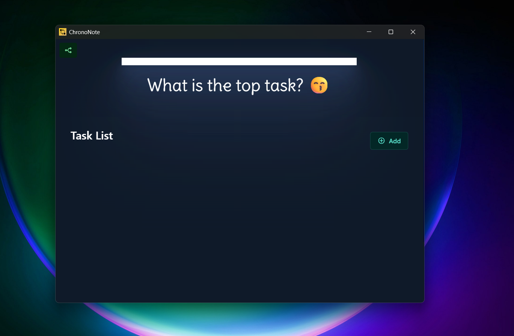
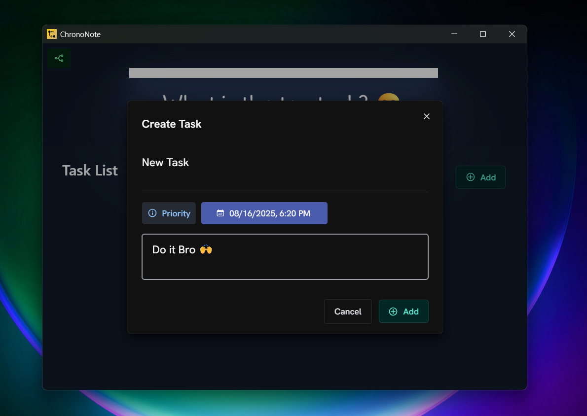
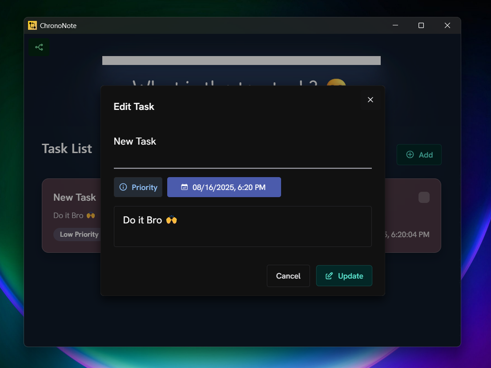
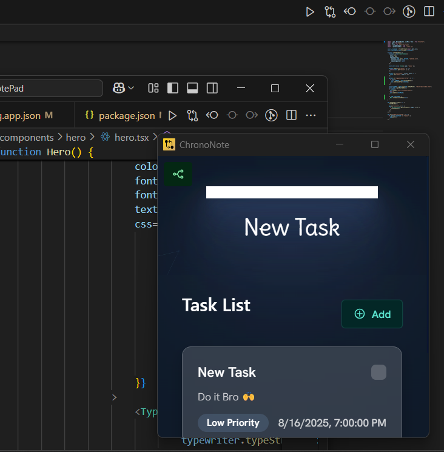

# ChronoNote

A modern, lightweight desktop task management application built with Electron and React.

## 🚀 Features

- **Modern & Clean UI**: Beautiful dark-themed interface with smooth animations
- **Task Management**: Create, edit, complete, and delete tasks with priorities
- **Priority System**: Built-in priority levels (Chill Mode, Focus Mode, Urgent Mode)
- **Due Date Tracking**: Set deadlines and track overdue tasks
- **Always-on-Top Mode**: Keep the app visible above other windows
- **Local Storage**: All data is stored locally for privacy
- **Responsive Design**: Works seamlessly on different screen sizes
- **Typewriter Animation**: Animated display of top priority task

## 🛠️ Tech Stack

- **Frontend**: React 19 + TypeScript + Vite
- **Desktop**: Electron 37
- **Styling**: Chakra UI + Tailwind CSS
- **State Management**: Redux Toolkit
- **Build Tool**: Vite
- **Packaging**: electron-builder

## 📦 Installation

### Download Latest Release
1. Go to [Releases](https://github.com/your-username/chrononote/releases) and download the appropriate version for your OS:
   - Windows: `.exe` or `.msi` installer
   - macOS: `.dmg` (coming soon)
   - Linux: `.AppImage` (coming soon)

### Build from Source
1. Clone the repository:
   ```bash
   git clone https://github.com/your-username/chrononote.git
   cd chrononote
   ```

2. Install dependencies:
   ```bash
   npm install
   ```

3. Run in development mode:
   ```bash
   npm run dev
   ```

4. Build for production:
   ```bash
   npm run build
   npm run buildApp:win  # For Windows
   ```

## 🎯 Usage

1. **Launch**: Open ChronoNote from your applications menu or desktop shortcut
2. **Create Tasks**: Click "Add" button to create new tasks
3. **Set Priorities**: Choose from Chill Mode, Focus Mode, or Urgent Mode
4. **Track Deadlines**: Set due dates and see overdue tasks highlighted
5. **Manage Tasks**: Mark tasks complete, edit, or delete them
6. **Stay Focused**: Use the always-on-top feature to keep your top task visible

## 📸 Screenshots

### Main Interface


### Task Creation


### Edit Mode


### Always on Top


## 🏗️ Project Structure

```
chrononote/
├── src/
│   ├── electron/          # Electron main process
│   │   ├── main.ts        # Main Electron entry
│   │   └── preload.cts    # Preload script
│   ├── ui/               # React frontend
│   │   ├── components/   # React components
│   │   ├── App.tsx       # Main React component
│   │   └── main.tsx      # React entry point
│   ├── feature/          # Redux store and reducers
│   └── hooks/            # Custom React hooks
├── demo/                 # Screenshot assets
├── release/              # Built applications
└── dist/                 # Production build
```

## 🚀 Available Scripts

- `npm run dev` - Start development mode
- `npm run build` - Build for production
- `npm run buildApp:win` - Build Windows executable
- `npm run lint` - Run ESLint
- `npm run preview` - Preview production build

## 🤝 Contributing

We welcome contributions! Please feel free to submit a Pull Request. For major changes, please open an issue first to discuss what you would like to change.

## 📄 License

This project is licensed under the MIT License - see the [LICENSE](LICENSE) file for details.

## 🙏 Acknowledgments

- [Electron](https://electronjs.org/) for the desktop framework
- [Chakra UI](https://chakra-ui.com/) for the beautiful components
- [React](https://reactjs.org/) for the frontend framework
- [Redux Toolkit](https://redux-toolkit.js.org/) for state management
- All the amazing open-source libraries that made this possible

---

Made with ❤️ by [Raj](mailto:rjsharmase@gmail.com)
